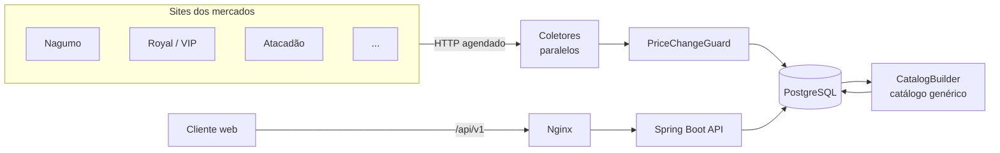

<p align="center">
  
</p>

<p align="center">
  <strong>Comparador de preços de supermercado em produção.</strong><br>
  Você monta a lista de compras e o Gomo mostra, com os preços de hoje, em qual mercado da cidade ela sai mais barata.
</p>

<p align="center">
  
  
  
  
  
  
</p>

## O que é

O Gomo é um **SaaS com backend em Java/Spring Boot**, do scraping ao deploy: **9 supermercados** de Volta Redonda e região, coletados **4 vezes por dia**, num catálogo de **~10 mil produtos comparáveis** (incluindo hortifrúti e açougue por kg). Tem contas com verificação de e-mail, plano gratuito com limites e trial do plano pago.

O valor do produto está numa regra simples e difícil de cumprir: **a busca devolve um produto genérico ("Coca-Cola 2 L"), nunca o anúncio de cada loja, e a comparação mostra só mercados com preço real e atual.** Nada de linha "indisponível" ou preço vencido.

## Os problemas difíceis

### 1. Cada mercado escreve o mesmo produto de um jeito

`Refr. Coca-cola 2lt Pet`, `REF COCA COLA 2L` e `Coca-Cola 2 Litros` são o mesmo item. O **catálogo genérico** reduz cada anúncio a uma chave de identidade (marca + variante + tamanho normalizado) e une as descrições equivalentes:

| Anúncio do mercado | Chave |
| --- | --- |
| `Refr. Coca-cola 2lt Pet` | `COCA COLA\|1x2000ML` |
| `Coca-Cola Sem Açúcar 2L` | `COCA COLA ZERO\|1x2000ML` |
| `Acucar Granulado Uniao 1kg Pre` (cortado em 30 caracteres) | une com `Açúcar Granulado União Premium 1kg` |

- **Expande abreviações de ERP** (`IOG`, `REQ`, `ACHOC`, `DESOD`...), lê tamanhos repetidos ("200M 0.2 lt") e reconhece marcas com número ("3 Corações").
- **Nunca une** sabor, variante ou embalagem diferente (zero, light, refil, sachê) e **descarta** kits, combos e "leve X pague Y".
- **Trava de segurança:** se a mesma loja vende SKUs com as duas descrições, elas são produtos diferentes e não são unidas.
- **IDs estáveis:** um item que perde mercados é desativado, nunca apagado, e as listas dos usuários migram sozinhas quando uma regra nova muda a chave.

Detalhes em [`docs/generic-catalog.md`](docs/generic-catalog.md) e [`docs/product-equivalence.md`](docs/product-equivalence.md).

### 2. Coletar preço de sites que não foram feitos para isso

- **7 tipos de coletor** (`nagumo`, `royal`, `vip`, `mercafacil`, `atacadao`, `hortifruti`, `flyer`), cada um com timeout, número de tentativas, limite de tamanho de resposta e intervalo entre requisições configuráveis.
- **Coleta paralela** (3 lojas ao mesmo tempo) com gravação sequencial no banco.
- **`PriceChangeGuard`:** um preço que varia fora da faixa esperada em relação ao anterior (ex.: erro de digitação do mercado) não é publicado; se a coleta seguinte confirmar o mesmo preço, ele vale. Preços de marcação (9999, R$ 500/kg) nunca viram preço.
- **Sites que mudam sozinhos:** quando um mercado publica uma versão nova do site, os coletores VipCommerce e Hortifruti encontram de novo a configuração e as consultas atuais nos scripts do próprio site.
- **Monitor:** `GET /api/v1/status/collections` responde 503 quando um mercado para de atualizar, antes de os preços dele vencerem; a área de admin mostra o último erro de cada coletor.
- **Agendamento** 4x ao dia, mais uma importação completa semanal com os produtos novos. Na subida, só os coletores com mais de 8 h sem coleta concluída rodam de novo.
- **Servidor novo pronto sozinho:** com o banco vazio, a aplicação carrega snapshots comprimidos dos 9 mercados e monta o catálogo (~15 min, cabe em 512 MB de heap).

### 3. Comparar uma lista inteira, não um produto

`ShoppingComparisonService` calcula para cada lista o total por mercado, a cobertura (quantos itens cada um tem), o subtotal parcial quando falta item e a **melhor combinação dividindo a compra entre lojas** (`SplitSavings`).

## Funcionalidades

- **Contas:** cadastro com verificação de e-mail, recuperação de senha com token de uso único e revogação de sessões.
- **Busca** que entende tamanho ("coca 1 litro") e só devolve itens com preço atual na cidade.
- **Comparação** por produto e por lista, do mais barato ao mais caro, com histórico de preços.
- **Listas de compras**, cidade preferida, lojas favoritas e **alertas de preço** com notificações internas.
- **Contribuições da comunidade** com moderação, e área administrativa com auditoria.
- **Freemium** aplicado no backend: plano gratuito com limites (3 mercados mais baratos, 5 comparações completas por dia, 1 lista) que respondem `403 PLAN_LIMIT`, e trial de 7 dias sem cartão.

## Arquitetura



O backend é organizado **por funcionalidade**: `auth`, `catalog`, `collection`, `comparison`, `shoppinglist`, `subscription`, `alert`, `contribution`, `admin`, `price`, `product`, `store`, `location` e `user`. Cada pacote tem seus controllers, services, repositories e DTOs. As entidades nunca são expostas pela API.

A interface web (`frontend/`, em React) consome só a API `/api/v1` e é publicada junto no mesmo domínio.

## Segurança

- **Tokens opacos** guardados no banco **só como hash**, com expiração e revogação. Nada de JWT impossível de invalidar.
- Senhas com **BCrypt** e política de tamanho (12 a 72 caracteres).
- **Rate limiting** de tentativas de login e de fluxos sensíveis (`AttemptRateLimiter`, `AbuseProtectionService`).
- Tokens de **uso único** para verificação de e-mail e redefinição de senha.
- Controle de acesso por papéis e **auditoria** das operações administrativas.
- Em produção, a API fica no **mesmo domínio** do site (`/api/v1` via Nginx), com `forward-headers-strategy=native` e CORS restrito.
- Segredos só por variáveis de ambiente. Veja [`.env.example`](.env.example).

## Qualidade e entrega

- **354 testes** (JUnit 5, Spring Boot Test e MockMvc): parsers dos coletores com fixtures reais de cada site, regras do catálogo genérico, comparação de listas, limites do plano, autenticação e persistência.
- **32 migrações Flyway** versionadas, com o Hibernate só validando o schema.
- **Deploy contínuo:** push na `main` → GitHub Actions (testes com PostgreSQL descartável e build do frontend) → SSH com *forced command* na VPS → `deploy.sh <sha>`, que faz backup do banco antes das migrations. A chave do deploy só aceita esse comando.
- **Docker Compose** com API, PostgreSQL e Mailpit para rodar o ambiente completo.

## Como rodar

Com Docker:

```bash
cp .env.example .env        # ajuste DATABASE_USERNAME e DATABASE_PASSWORD
docker compose up --build
```

Sem Docker (JDK 21, Node 20+ e PostgreSQL):

```bash
./mvnw spring-boot:run                  # API, com as variáveis de .env.example

cd frontend
cp .env.example .env
npm install && npm run dev              # http://localhost:5173
```

O guia completo do ambiente local, da coleta e das sementes está em [`docs/local-development.md`](docs/local-development.md). As fontes de dados e suas limitações estão em [`docs/data-sources.md`](docs/data-sources.md).

## Status

Em produção. Já estão no ar: coleta, catálogo, comparação, listas, alertas e plano gratuito. A cobrança do plano pago (checkout e webhooks) **ainda não está integrada**: hoje o acesso premium vem do trial.

---

Desenvolvido por **[Tutzdev](https://github.com/Tutzdev)**.
